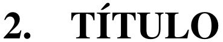
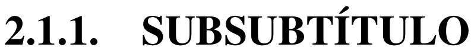

# CREAR UN ARTÍCULO EN LATEX Y PUBLICARLO EN CODEAUNI

Para mayor comodidad a la hora de crear un artículo para la plataforma de [CODEa UNI](https://www.codeauni.com/) he preferido usar [LaTeX](https://www.latex-project.org/) y [Vim](https://www.vim.org/).

<!--[](https://www.codeauni.com/inicio/)-->

## ARCHIVOS NECESARIOS

```sh
 __ codeauni.tex
|__ convertirFormato.js
|__ img
|   |__ 1.png
|__ template.html
```

## FORMATO DEL ARTÍCULO EN LATEX (codeauni.tex)

1. Títulos

    ```tex
    \section{TÍTULO}
    ```

    

2. Subtítulos

    ```tex
    \subsection{SUBTÍTULO}
    ```

    

3. Subsubtítulos

    ```tex
    \subsubsection{SUBSUBTÍTULO}
    ```

    

4. Texto

    ```tex
    El texto lo escribes simplemente así.

    Así escribes otro párrafo.
    ```

    

5. Imágenes

    ```tex
    \begin{figure}[h]
        \centering
        \includegraphics[width=0.7\textwidth]{img/1.png}
        \caption{descripcion}
    \end{figure}
    ```

    

6. Código

    ```tex
    \begin{lstlisting}[style=PythonStyle]
    #codigo python
    for i in range(1, 10):
        print(f"Hola Mundo {i}")
    \end{lstlisting}
    ```

    

7. Tabla

    ```tex
    \begin{table}[htbp]
        \begin{center}
            \caption{Geox 8}
            \begin{tabular}{|c|c|}
                \hline
                \textbf{Autonomía} & \textbf{Velocidad}\\
                \hline
                25 minutos & 100 Km/h\\
                \hline
            \end{tabular}
        \end{center}
    \end{table}
    ```

    

8. Video

    ```tex
    \begin{center}
        \href{https://www.youtube.com/watch?v=Px4GHgnrj1A}{DescripcionVideo}
    \end{center}
    ```

    

9. Conclusiones

    ```tex
    \section*{CONCLUSIONES}
    \begin{enumerate}
        \item conclusión uno.
        \item conclusión dos.
    \end{enumerate}
    ```

    

10. Referencias

    ```tex
    \section*{REFERENCIAS}
    \begin{enumerate}
        \item \href{www.google.com}{google}
        \item \href{www.facebook.com}{facebook}
    \end{enumerate}
    ```

    

## CONVERTIR LATEX A FORMATO HTML DE LA PLATAFORMA CODEa UNI

1. Convertimos el código LaTeX a código html.

    ```sh
    $ pandoc -s codeauni.tex --number-sections --template=template.html -o codigo.html
    ```

2. Se obtiene el archivo `codigo.html`, necesitamos abrirlo con un navegador.

    ```sh
    $ google-chrome codigo.html
    ```

    

3. Automáticamente se va a descargar `paginaModificada.html`, el contenido de este archivo html es lo que queremos y el cual vamos a copiar en la plataforma de CODEa UNI.  
Lo abrimos con un navegador si queremos ver el resultado final.

    ```sh
    $ google-chrome paginaModificada.html
    ```

## PUBLICAR ARTÍCULO EN LA PLATAFORMA DE CODEa UNI

1. En la plataforma de Codea UNI ingresar a tu cuenta de usuario.

    

2. Vamos a administrar publicaciones

    

3. Creamos una publicación

    

4. Clic para habilitar la fuente html

    

5. Pegamos el contenido del archivo  `paginaModificada.html`.

    

6. Volvemos a dar clic en `Fuente HTML` para ver el resultado.

    

7. Doble clic en la imagen

    

8. Aparece el nombre de la imagen, tenerlo presente porque ese es el nombre de la imagen que subiremos a la plataforma.

    

9. Clic en cargar y seleccionamos la imagen

    
    

10. Clic en **Enviar al Servidor**

    

11. En anchura y altura seleccionamos 70%

    

12. Ahora se puede observar la imagen cargada

    

13. Colocar un título

    

14. Completamos los demás campos y clic en guardar

    
    

15. Si queremos ya podemos publicarlo

    
